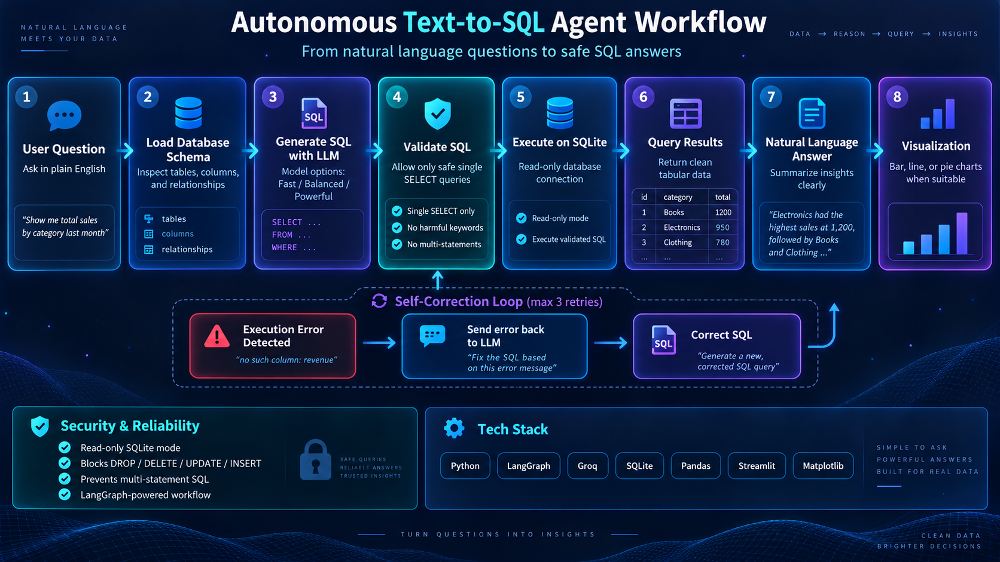

# Autonomous Text-to-SQL Agent with LangGraph & Groq

<div align="center">

[](https://github.com/Abo0wael)
[](https://www.linkedin.com/in/ahmed-wael-9a6a5938a)
[](https://autonomous-text-to-sql-agent-ahmedwael.streamlit.app/)
[](https://github.com/langchain-ai/langgraph)
[](https://groq.com)

</div>

An enterprise-grade, student-friendly **Autonomous Text-to-SQL Agent** built for the Elevvo AI Internship. This agent translates natural language questions into SQLite-compatible queries, rigorously validates them against security rules, executes them safely against a relational database, automatically self-corrects on execution errors (up to 3 retries), and returns both structured DataFrames and plain-English business summaries with interactive data visualizations.

Available both as an in-depth **educational Jupyter Notebook** and an executive **Streamlit Web Application**.

---

## 🌐 Live Demo

- **Live App URL**: [https://autonomous-text-to-sql-agent-ahmedwael.streamlit.app/](https://autonomous-text-to-sql-agent-ahmedwael.streamlit.app/)

### 📸 Application Preview
```
+-----------------------------------------------------------------------------------------+
|  🧠 Autonomous Text-to-SQL Agent                                                       |
|  Ask questions in natural language. Get real answers from your relational database.     |
|  [LangGraph State Machine] [Groq LLM Acceleration] [SQLite Read-Only Engine]            |
+-----------------------------------------------------------------------------------------+
|  💡 Example Questions: [Top 5 Customers] [Revenue by Country] [10 Best-Selling Tracks]  |
|                                                                                         |
|  [ Enter your question about the Chinook database:                              ] [Run] |
|                                                                                         |
|  Tabs: [💬 Answer] [📝 Generated SQL] [📊 Data Table] [📈 Visualization] [🔍 Agent Trace] |
+-----------------------------------------------------------------------------------------+
```

---

## 📋 Table of Contents
1. [Project Overview](#-project-overview)
2. [Key Features](#-key-features)
3. [Tech Stack](#-tech-stack)
4. [Agent Architecture & Workflow Diagram](#-agent-architecture--workflow-diagram)
5. [Groq Model Options](#-groq-model-options)
6. [Setup & Installation](#-setup--installation)
   - [Conda Environment Setup](#1-conda-environment-setup)
   - [Install Dependencies](#2-install-dependencies)
   - [Configure Groq API Key](#3-configure-groq-api-key)
7. [How to Run Locally](#-how-to-run-locally)
   - [Run the Streamlit Web Application](#1-run-the-streamlit-web-application)
   - [Run the Educational Jupyter Notebook](#2-run-the-educational-jupyter-notebook)
8. [Streamlit Cloud Deployment](#-streamlit-cloud-deployment)
9. [Example Benchmark Questions](#-example-benchmark-questions)
10. [Self-Correction Mechanism](#-self-correction-mechanism)
11. [Two-Layer Security Architecture](#-two-layer-security-architecture)
12. [Future Improvements](#-future-improvements)
13. [Author & Connect](#-author--connect)

---

## 🚀 Project Overview

Relational databases power global commerce, but querying them requires mastery of structured SQL syntax. Non-technical decision-makers (such as product managers, executives, and analysts) frequently encounter data friction.

This project delivers:
1. **Interactive Streamlit Web Dashboard (`app.py`)**: A dark AI futuristic dashboard with dynamic model switching, clickable sample questions, tabbed visual results, and real-time self-correction traces.
2. **Reference Educational Notebook (`Text_to_SQL_Agent.ipynb`)**: A comprehensive, step-by-step notebook organized into 22 learning-friendly sections.

The agent interacts with the **Chinook** SQLite database (representing a digital media store with customers, invoices, tracks, albums, and artists) using dynamic schema introspection without hardcoding table names.

---

## ✨ Key Features

- **Dynamic Schema Inspection**: Introspects tables, column data types, primary keys, and foreign keys directly from SQLite metadata catalogs (`sqlite_master`, `PRAGMA table_info`, `PRAGMA foreign_key_list`). No hardcoding!
- **State Machine Orchestration**: Built with **LangGraph** using explicit nodes, typed state dictionaries (`TypedDict`), and conditional edge routing.
- **Dynamic Groq Model Selector**: Switch seamlessly in the sidebar between Fast (20B), Balanced (27B), and Powerful (120B) models.
- **Two-Layer Security Guardrails**:
  1. *Connection Level*: SQLite URI read-only mode (`file:data/Chinook_Sqlite.sqlite?mode=ro`, `uri=True`).
  2. *Query Level*: Zero-trust regex validator strictly allowing single `SELECT` / `WITH` statements and blocking `DROP`, `DELETE`, `UPDATE`, `INSERT`, `ALTER`, etc.
- **Autonomous Self-Correction**: Automatically captures SQLite syntax and runtime errors, feeds the diagnostic message back to the LLM, regenerates a corrected query, and re-executes (capped at 3 attempts).
- **Executive Summaries & Visual Analytics**: Synthesizes tabular query results into concise natural language answers and Matplotlib visualizations (Bar, Horizontal Bar, Line, Pie).
- **Observable Agent Trace**: Audits real-time state machine transitions and events without exposing hidden LLM reasoning or chain-of-thought.

---

## 🛠 Tech Stack

- **Language**: Python 3.11
- **Web Interface**: Streamlit
- **LLM Orchestration**: LangChain, LangGraph (`langgraph`, `langchain-core`)
- **LLM Provider**: Groq Cloud API via `langchain-groq`
- **Database Engine**: SQLite3 (Read-Only URI mode)
- **Data Analysis**: Pandas
- **Visualization**: Matplotlib
- **Environment Management**: Conda, python-dotenv
- **Notebook**: Jupyter Notebook (`Text_to_SQL_Agent.ipynb`)

---

## 🧠 Groq Model Options

Select your preferred model directly from the Streamlit sidebar:

| Model Option | Model ID | Strengths & Use Case |
|:---|:---|:---|
| **Model 1 - Fast** | `openai/gpt-oss-20b` | Lightweight 20B model with ultra-low latency. Ideal for rapid answers to standard queries. |
| **Model 2 - Balanced** *(Default)* | `qwen/qwen3.8-27b` | High precision, 27B parameters. Highly accurate on multi-table joins and aggregations. |
| **Model 3 - Powerful** | `openai/gpt-oss-120b` | Flagship 120B reasoning model. Excels at complex analytical queries and self-correction. |

> *Tip: If one model reaches an output token rate limit, simply select another model from the sidebar and re-run.*

---

## 🔄 Agent Architecture & Workflow Diagram

An end-to-end autonomous pipeline translates natural language questions into safe, optimized SQLite queries, featuring dynamic schema introspection, zero-trust security checks, and real-time self-correction loops.

<div align="center">
  
  <br>
  <em>Autonomous Text-to-SQL Agent end-to-end workflow</em>
</div>

<br>

```
                     +---------------------------+
                     |    User Asks Question     |
                     +---------------------------+
                                   |
                                   v
                     +---------------------------+
                     | 1. Dynamic Schema Loader  |
                     +---------------------------+
                                   |
                                   v
                     +---------------------------+
                     | 2. SQL Generator (LLM)    |
                     +---------------------------+
                                   |
                                   v
                     +---------------------------+
                     |   3. Security Validator   |  ---(Security Alert)---> [Self-Correction]
                     +---------------------------+                                  |
                                   | (Valid)                                        |
                                   v                                                |
                     +---------------------------+                                  |
                     |  4. Read-Only Execution   |                                  |
                     |    (mode=ro URI Mode)     |                                  |
                     +---------------------------+                                  |
                                   |                                                |
                 +-----------------+-----------------+                              |
                 |                                   |                              |
           (Execution OK)                     (Execution Error)                     |
                 |                                   |                              |
                 v                                   v                              |
     +-----------------------+           +-----------------------+                  |
     | 5. Answer Generation  |           | 6. Self-Correction    |<-----------------+
     +-----------------------+           | (LLM + Error Feedback)|
                 |                       +-----------------------+
                 v                                   | (Attempts < 3)
     +-----------------------+                       |
     |  Visualizations &     |<----------------------+ (Loop back to Validator)
     |  Final Response       |
     +-----------------------+ (If Attempts >= 3: Graceful Exit)
                 |
                 v
               [END]
```

---

## 📦 Setup & Installation

### 1. Conda Environment Setup
Activate your existing environment:
```bash
conda activate text2sql-agent
```

Or create a new environment:
```bash
conda create -n text2sql-agent python=3.11 -y
conda activate text2sql-agent
```

### 2. Install Dependencies
```bash
pip install -r requirements.txt
```

### 3. Configure Groq API Key
1. Copy `.env.example` to `.env`:
   ```bash
   cp .env.example .env
   ```
2. Open `.env` and set your key:
   ```env
   GROQ_API_KEY=gsk_your_actual_groq_api_key_here
   ```

---

## 💻 How to Run Locally

### 1. Run the Streamlit Web Application
```bash
streamlit run app.py
```
Open your browser at `http://localhost:8501`.

### 2. Run the Educational Jupyter Notebook
```bash
jupyter notebook Text_to_SQL_Agent.ipynb
```
Select kernel **`Python (text2sql-agent)`** to inspect all 22 sections and saved outputs.

---

## ☁️ Streamlit Cloud Deployment

Deploy this project on **Streamlit Community Cloud** in 6 simple steps:

1. **Push to GitHub**:
   Commit and push the repository to your GitHub account:
   ```bash
   git add .
   git commit -m "Deploy Autonomous Text-to-SQL Agent"
   git push origin main
   ```
   *(Note: `.env` is ignored by `.gitignore` to keep your API key secure).*

2. **Open Streamlit Community Cloud**:
   Go to [share.streamlit.io](https://share.streamlit.io) and log in with GitHub.

3. **Create New App**:
   Click **"New app"** and select your repository, branch (`main`), and main file path:
   ```
   Main file path: app.py
   ```

4. **Configure Secrets**:
   Click **"Advanced settings..."** $\rightarrow$ **"Secrets"**, then enter:
   ```toml
   GROQ_API_KEY = "gsk_your_actual_groq_api_key_here"
   ```

5. **Deploy**:
   Click **"Deploy!"**. Streamlit Cloud installs `requirements.txt` and serves your app globally.

6. **Access Deployed Application**:
   Your live application is deployed at: [https://autonomous-text-to-sql-agent-ahmedwael.streamlit.app/](https://autonomous-text-to-sql-agent-ahmedwael.streamlit.app/)

---

## 📊 Example Benchmark Questions

| # | Question | Key SQL Pattern | Result Summary |
|---|:---|:---|:---|
| 1 | *"What are the top 5 customers by total spending?"* | `JOIN Invoice`, `GROUP BY CustomerId`, `ORDER BY TotalSpent DESC LIMIT 5` | Top spender: Helena Holá ($49.62), followed by Richard Cunningham ($47.62). |
| 2 | *"Which country has the highest total invoice revenue?"* | `GROUP BY BillingCountry`, `ORDER BY SUM(Total) DESC LIMIT 1` | USA generated highest revenue ($523.06). |
| 3 | *"Show the 10 best-selling tracks."* | `JOIN InvoiceLine`, `GROUP BY TrackId`, `ORDER BY SUM(Quantity) DESC LIMIT 10` | Identifies top tracks with tied high volumes. |
| 4 | *"How many customers are there in each country?"* | `GROUP BY Country`, `ORDER BY COUNT(*) DESC` | USA leads with 13 customers, Canada has 8, Brazil and France each have 5. |
| 5 | *"Which artist has the most tracks?"* | Multi-join `Artist` $\rightarrow$ `Album` $\rightarrow$ `Track`, `GROUP BY ArtistId`, `LIMIT 1` | Iron Maiden with 213 tracks, followed by Led Zeppelin (114 tracks). |

---

## 🔁 Self-Correction Mechanism

When an error occurs during query execution:
1. The exception is intercepted cleanly without crashing the web app.
2. The agent compiles diagnostic context:
   - User question
   - Extracted schema
   - Failed SQL query
   - Exact SQLite error message (e.g. `no such column: NonExistentCol`)
3. The LLM acts as an autonomous debugger, diagnoses the problem, and generates a corrected query.
4. The healed query is re-validated and executed.
5. The Streamlit UI displays a distinct **"Self-Correction Activated"** card with an expander showing the full correction trace.

---

## 🔒 Two-Layer Security Architecture

1. **Database Engine Level**:
   - The connection is opened with SQLite URI read-only flag:
     `file:data/Chinook_Sqlite.sqlite?mode=ro` (`uri=True`).
   - Any write or modification attempted at the database level is rejected by the SQLite engine itself.

2. **Application Validator Level**:
   - Strict AST/Regex security gate:
     - Enforces single `SELECT` or `WITH ... SELECT`.
     - Word-boundary regex blocks: `INSERT`, `UPDATE`, `DELETE`, `DROP`, `ALTER`, `CREATE`, `TRUNCATE`, `REPLACE`, `ATTACH`, `DETACH`, `EXEC`, `PRAGMA`, `MERGE`, `UPSERT`.
     - Blocks semicolon-chained multi-statement injections.

---

## 🔮 Future Improvements

1. **Schema RAG**: For massive enterprise databases with hundreds of tables, use vector search to inject only relevant table schemas into the prompt.
2. **Query Plan Explainability**: Incorporate `EXPLAIN QUERY PLAN` to warn users about slow full-table scans on massive datasets.
3. **Few-Shot Domain Prompts**: Inject business-specific calculations (e.g. churn rate, MRR) as dynamic few-shot examples.

---

## 👨‍💻 Author & Connect

<div align="center">

### **Ahmed Wael**
*AI / Software Engineer &bull; Elevvo AI Intern*

[](https://github.com/Abo0wael)
[](https://www.linkedin.com/in/ahmed-wael-9a6a5938a)

</div>

- 🐙 **GitHub**: [@Abo0wael](https://github.com/Abo0wael)
- 💼 **LinkedIn**: [linkedin.com/in/ahmed-wael-9a6a5938a](https://www.linkedin.com/in/ahmed-wael-9a6a5938a)
- 🎓 **Internship**: Elevvo AI Internship

---
*Elevvo AI Internship Project - Autonomous Text-to-SQL Agent.*

